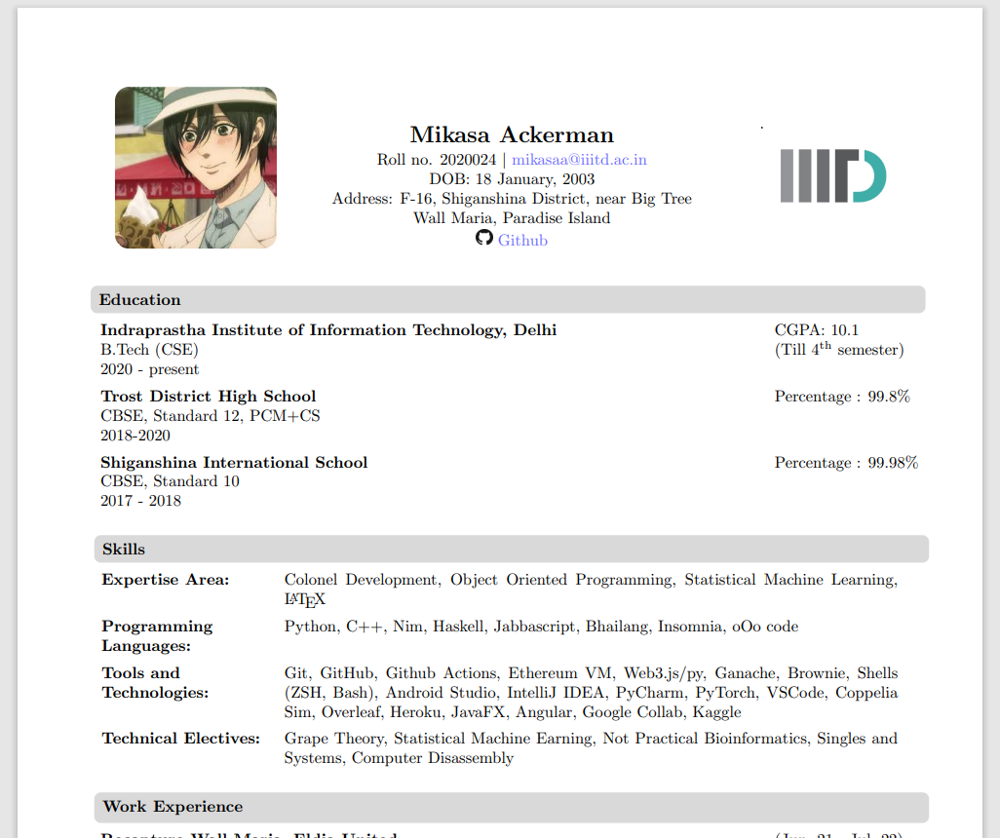
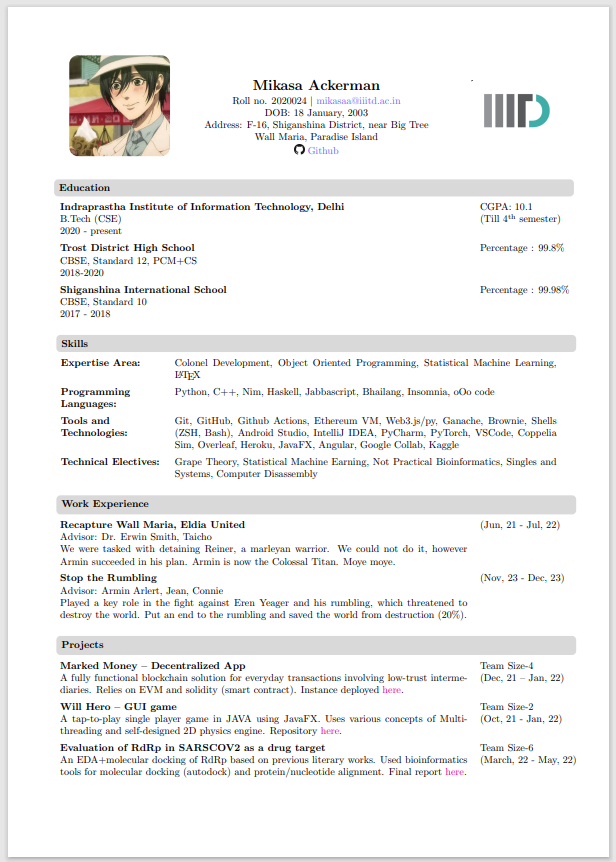

# IIIT Delhi Resume
A fully-customizable resume template in IIIT Delhi format made with $\LaTeX$. I created this template for the on-campus internship placements because why not.

I am a $\LaTeX$ god.

I tried various ways to make a resume in this format but none of them allowed me to exhibit all my **pro-ness** I wanted and still keep it within two pages. So, I decided to write it myself!

Thanks to Leslie Lamport for making this awesome software.

IIITD folks, feel free to customize and use this for yourself and get 👏 that 👏 cake 👏.

# How To Use This Template
The resume is generated completely from the data in main.tex. Just open the file with your notepad/text editor (vim if you are a pro too) and replace the dummy credentials with yours.

The styles can be edited according to your preference in apMod.sty. I've added the styles suited to the amount of information I wanted to display on my resume. You might have to tweak the styles according to your needs.

Your resume should typically be a single page, but the IIITD format is a bit rigid so it's okay if your IIITD resume extends to two pages. Try not to make it beyond two pages though.

# Steps To Set Up
- Download the repository
- Compile (You may use mikitex OR just upload it on Overleaf, it's simple)

# Sample
- Open the IIITD_Resume_template.pdf
- Alternatively, visit [here](https://anindya-prithvi.github.io/filehost/IIITD_Resume_template.pdf)
  

___

Readme adopted from [Ananya Lohani's previous work (HTML/CSS based)](https://github.com/ananyalohani/iiitd-resume)  
Image of Viper(from Valorant) distributed under creative commons.